```{r setup, include=FALSE, message = FALSE}
options(scipen = 0, digits = 3)  # controls number of significant digits printed
library(tidyverse)
library(kableExtra)
```


```{=latex}
\includegraphics{minds-vector-image.jpg}
\newpage
% Trigger ToC creation in LaTeX
\hypersetup{linkcolor=black}
\tableofcontents
```

\bigskip

The code to reproduce this report is available [on Github](https://github.com/emoneil/final-project).

\newpage

# Executive Summary

**Problem.** According to the [National Alliance on Mental Illness](https://www.nami.org/mhstats), 1 in 5 U.S. adults experience mental illness each year. Although there is much research on the nature of specific mental disorders and their frequency in the population, there is still much to be learned about the circumstances in which individuals struggle with mental health challenges and the relative importances of certain factors for one's mental health. Thus, I decided to look into social and economic variables, measures of the receival of clinical care, health factors, and the availability of mental health facilities offering resources such as diagnostic evaluation and pay assistance by state, moreover, analyzing which factors were most predictive of the number of days in a month a person's mental health was not good in 2019.

**Data.** My dataset is comprised of data from two sources. The primary dataset is Behavioral Risk Factor Surveillance System (BRFSS) annual survey data from the Centers for Disease Control and Prevention (CDC) which includes data about U.S. residents regarding their health-related risk behaviors, chronic health conditions, and use of preventive services. The second dataset is the 2019 National Mental Health Services Survey (N-MHSS) from the Substance Abuse and Mental Health Data Archive (SAMHDA), which is an annual survey that collects data on the services and characteristics of all known mental health treatment facilities in the 50 states, the District of Columbia, and the U.S. territories and jurisdictions. N-MHSS is the only source of national and state-level data on the mental health service delivery system reported by both public and private specialty mental health treatment facilities. Our explanatory variables span four main categories: social and economic factors (e.g., race, sex, income), clinical care (e.g., health coverage, length of time since last routine checkup), health behaviors (e.g., number of days in month physical health not good, fruit and vegetable intake), and mental health facility counts offering certain resources by state (e.g., diagnostic evaluation, pay assistance, sliding scale fee). Our primary response variable of interest was the number of days a person reported that his/her mental health was not good in the past month.

**Analysis.** Before exploring the data, I split the data into a training dataset and a test dataset, with the test dataset reserved for assessing model performance. I then explored the training data to understand the response distribution, observe the response variable across different states, discover its relationship with race and individual healthcare access cost barriers, and assess relationships among variables. I then built seven different cross-validated models: ordinary least squares, ridge regression, lasso regression, elastic net regression, decision tree, random forest, and boosting. Unfortunately, due to my limited computing power, the training of my random forest and boosting models was restricted to a random fraction of the training data. Of the regression models, linear regression had the lowest test error and of the tree-based models, the decision tree had the lowest test error (marginally better over the boosting model which had been trained on a subset of the training data). Linear regression had the overall lowest test error.

**Conclusions.** I found that there was some consensus among the models in terms of the variables measured to be the most important of the features in predicting the number of days someone's mental health was not good. My models taken together suggest that the variables identifying the number of days someone's physical health was not good, age, employment status, and healthcare limitations due to medical costs are important. This highlighted how physical activity, age, employment status, and economic access barriers were more predictive of the number of bad mental health days in a month a person had than other demographic, health, mental health facility concentration, and clinical care related variables. While the predictive performance of my models were limited and not far better than an intercept-only model, I hope that this analysis, considering the significant relationships between mental health and physical activity, mental health and having a job, and mental health with access to healthcare, can nonetheless support policies aimed at improving mental healthcare access; inform the development of mental health interventions that can take advantage of the relationship of one's mental health with one's physical health and activity; and inspire future analyses that can explore other variables such as local mental health resource abundance, specific adverse life experiences, and perceived stigma.

# Introduction

**Background.** 

Millions of people in the U.S. are affected by mental illness each year^[Mental Health by the Numbers. National Alliance on Mental Illness. https://www.nami.org/mhstats]. WHO Director-General Tedros Adhanom Ghebreyesus has called it "a silent killer" [Simpson, B. (2019, May 23). A new plan for Mental Illness, the silent killer. Global Health NOW. https://www.globalhealthnow.org/2019-05/new-plan-silent-killer.]. Researchers now know that the prevention of mental, emotional, and behavioral disorders is inherently interdisciplinary and can meaningfully draw on a variety of strategies.^[National Research Council and Institute of Medicine. (2009). Preventing Mental, Emotional, and Behavioral Disorders Among Young People: Progress and Possibilities. Washington, DC: The National Academies Press.https://doi.org/10.17226/12480.] It is essential to utilize various data sources to understand the co-occurrence of individual mental health challenges with social and economic circumstances and its relation to physical health, exercise, and diet. Moreover, an analysis of reported mental health against a variety of variables (such as risk behaviors and demographics) and exploration of predictive factors may help inform strategies to improve public mental health policies that could mitigate suffering in the existing mental health pandemic.^[Owens, C. (2021, October 30). Mental health problems have become America's shadow epidemic. Axios. https://www.axios.com/mental-health-pandemic-shadow-epidemic-51f98123-ae6b-429f-8d40-4c2c8270e7de.html.]

There is growing research on how social determinants impact mental health outcomes.^[Alegría, M., NeMoyer, A., Falgàs Bagué, I., Wang, Y., & Alvarez, K. (2018). Social Determinants of Mental Health: Where we are and where we need to go. Current Psychiatry Reports, 20(11). https://doi.org/10.1007/s11920-018-0969-9] For example, unemployment continues to be regularly linked to increased psychological distress.^[Han, S., & Lee, H-S. (2013). Social Capital and Depression: Does Household Context Matter? Asia Pacific Journal of Public Health, 27(2). https://doi.org/10.1177/1010539513496140] Yet there is still much to be learned, including differences in risk factors for mental health struggles on the broader population levels, the influence of the resources of mental health facilities in one's state, and understanding of the relative importance of factors that span a diverse set of categories: social, economic, healthcare access, physical well-being, even nutrition.

**Analysis goals.** Given that there are many factors that contribute to individual mental health, I wanted to investigate how a measure of one's reported mental health (i.e., the number of days his/her mental health is not good) is related to a variety of variables. Specifically, I was interested in which kinds of factors (e.g., mental health facility resources in state, clinical care experience and access, social and economic, health including diet), and which variables in particular, are most predictive of the number of days in the past month one's mental health is not good. All features are described in Appendix \@ref(appendix). Ideally, my modeling will be able to help capture what differentiates those who are at the right end of the spectrum for the response variable (high number of days when mental health was not good in past month), and at least provide insight into which of these several variables are most related to one's mental health status.

**Significance.** I hope that my analysis will contribute to the growing research on risk factors related to mental health through the expansion of our understanding of the extremely multi-dimensional nature of mental health. I hope that it can help support efforts to develop policies and programs that can serve vulnerable communities and increase awareness of this vital component of our overall well-being. My results also highlight the importance of targeting certain communities (e.g., by age, income level) that may be more vulnerable and the need to make health resources more accessible not only for physical healthcare but also mental healthcare.

# Data

## Data sources

My dataset merged data from two sources: a dataset from a U.S. behavioral risk factor survey and a dataset of mental health facilities in the U.S. Each data source includes data from 2019. 

The data that involves individual responses regarding behavioral risk factors is annual survey data from the Behavioral Risk Factor Surveillance System. CDC's state and territorial partners use the Behavioral Risk Factor Surveillance System (BRFSS) to collect uniform, specific data about health and wellness.^[Behavioral Risk Factor Surveillance System. (n.d.) https://www.cdc.gov/brfss/index.html.] The Behavioral Risk Factor Surveillance System (BRFSS) is the nation’s premier system of health-related telephone surveys that collect state data about U.S. residents regarding their health-related risk behaviors, chronic health conditions, and use of preventive services. BRFSS completes more than 400,000 adult interviews each year, making it the largest continuously conducted health survey system in the world. The survey includes measures of clinical care, health, and social and economic factors. That is, factors assessed by the BRFSS in 2019 included for example health status, healthy days/health-related quality of life, health care access, exercise, chronic health conditions, alcohol consumption, immunization. Since 2011, the BRFSS has been conducting both landline telephone and cellular telephone-based surveys. All the responses were self-reported.  In conducting the landline telephone survey, interviewers collect data from a randomly selected adult in a household. In conducting the cellular telephone survey, interviewers collect data from adults answering the cellular telephones residing in a private residence or college housing. Following guidelines provided by the BRFSS, state health personnel or contractors conduct interviews. States conducted telephone interviews during each calendar month. They made calls 7 days per week, during both daytime and evening hours. I selected a range of variables spanning this range of implicit categories (also being sure not to select variables effectively measuring the same thing or those that would be heavily correlated).^[Centers for Disease Control and Prevention. (2020, August 31). CDC - 2019 BRFSS Survey Data and Documentation. Centers for Disease Control and Prevention. https://www.cdc.gov/brfss/annual_data/annual_2019.html.]

The other dataset I drew from is the N-MHSS mental health facilities dataset that includes data from 2019 on the services and characteristics of all known mental health treatment facilities in the U.S. states.^[National Mental Health Services Survey (N-MHSS) mental health facilities data. National Mental Health Services Survey 2019 (N-MHSS-2019-DS0001) | SAMHDA. (n.d.). https://www.datafiles.samhsa.gov/dataset/national-mental-health-services-survey-2019-n-mhss-2019-ds0001.] N-MHSS is the only source of national and state-level data on the mental health service delivery system reported by both public and private specialty mental health treatment facilities; including public and private psychiatric hospitals; nonfederal general hospitals with separate psychiatric units; U.S. Department of Veterans Affairs medical centers; residential treatment centers for children and adults; community mental health centers; outpatient, day treatment, or partial hospitalization mental health facilities; and multi-setting (nonhospital) mental health facilities. The Center for Behavioral Health Statistics and Quality (CBHSQ) of the Substance Abuse and Mental Health Services Administration (SAMHSA), U.S. Department of Health and Human Services, plans and directs the N-MHSS. There were three data collection modes employed: a secure web-based questionnaire, a paper questionnaire sent by mail, and a computer-assisted telephone interview (CATI). Four weeks before the survey reference date, SAMHSA mailed letters to the attention of the facility directors of all eligible facilities to alert them to expect the survey and to request their participation in the N-MHSS. A data collection packet was mailed to each facility on April 30, 2019. The web-based survey also became available at the same time. Each facility had the option of completing the questionnaire via the secure survey website or asking for a paper questionnaire to complete and return via postal mail. In August 2019, another, similar packet was sent to non-responding facilities, this time including a copy of the questionnaire, a definitions packet, and a postage-paid return envelope.^[National Mental Health Services Survey (N-MHSS): 2019 Codebook | SAMHDA. (n.d.). https://www.datafiles.samhsa.gov/dataset/national-mental-health-services-survey-2019-n-mhss-2019-ds0001]

## Data cleaning

My central tasks in the data cleaning phase of the project were aggregating variables grouped by state for the N-MHSS data and merging the data from the two sources described above. Both data sources included a state variable ("LST" in N-MHSS data); however, it was represented as a FIPS code in the BRFSS data and as a state abbreviation in the N-MHSS data. Since I was interested in seeing if the prevalence of mental health facilities with certain resources/options could help predict one's days in the past month when his/her mental health was not good, I summed the number of observations, i.e., mental health facilities, by state, with a yes response for any given variable of interest (e.g., facility offers mental health diagnostic evaluation, facility uses a sliding fee scale). I merged the two datasets based on the state, i.e., the state one resided in in the BRFSS data merged with the state-level aggregate data on mental health facilities. Additionally, I selected a subset of features, removing those that would be heavily correlated with selected variables/were essentially measuring the same thing (e.g., some calculated variables or original variables, depending on which captured the most information). I also sacrificed including additional variables that were answered by a much smaller fraction of respondents in order to ideally get a more representative dataset reflecting the U.S.'s population. Furthermore, I removed observations with missing values. I examined the mental health response variable used as well as a calculated variable in the dataset that was a categorical transformation (calculated variable) of my response variable with only a few levels. However, I decided to pursue the original mental health variable given that it captures more information and can translate to a regression problem. I also removed observations where the response was "Don't know/Not sure" or "Refused" and altered the coding of "None" to be 0 (to reflect 0 days that someone reported that his/her mental health was not good in the past month). I made similar modifications to the variable reflecting the number of days one's physical health was not good in the past month since the nature of the variable and its response options was similar (days in past month). (I also removed observations with "Don’t know/Not Sure Or Refused/Missing" for the alcohol consumption variable in order to treat it as a non-categorical variable.) I coded categorical variables as factors, observing the BRFSS codebook.^[Centers for Disease Control and Prevention. (n.d.). LLCP 2019: Codebook report. Centers for Disease Control and Prevention. https://www.cdc.gov/brfss/annual_data/2019/pdf/codebook19_llcp-v2-508.HTML] Additionally, I renamed all columns so that the variable names would be more meaningful and instantaneously interpretable in plots. 

## Data description

### Observations

My dataset has a total of 295310 observations, each of which corresponds to an individual person/respondent of the BRFSS survey.

### Response Variable

My response variable is the number of days someone reported that his/her mental health was not good in the past month. In particular, it is a respondent's answer to the following question: "Now thinking about your mental health, which includes stress, depression, and problems with emotions, for how many days during the past 30 days was your mental health not good?" I treated it as effectively a continuous variable, i.e., considering it as a regression problem. I used this as my response variable as a proxy for/reflection of one's reported mental health status (which is perhaps even more important and salient than any formally diagnosed mental health condition). However, it is perhaps worth noting that respondents who find this question uncomfortable may answer in such a way that does not reflect their true experience.

### Features

Drawing on data from the two sources described (i.e., the BRFSS annual survey data and state aggregated version of N-MHSS mental health facilities data), I included 50 explanatory variables in my analysis (which excludes the state variable, which was used for merging the datasets but not used as a feature for modeling), which we can consider to fall into four main categories: state mental health facilities programs and resources, social and economic factors, clinical care, and health including nutrition. For a detailed specification of these variables, refer to Appendix \@ref(appendix).

## Data allocation

Before building my predictive models, I removed observations from the dataset for which any variables had NA values (as some analysis methods utilized require that no variables contain NA values). I split my dataset into two subsets: a training dataset used for building my predictive models and a test dataset used for evaluating my models. I used an 80-20 split, such that the training dataset consists of 80% of observations and the testing dataset consists of 20% of observations. I utilized a seed to ensure that the split can generate reproducible results. I explored the training data, built the models on the training data, and used the test solely for model evaluation. Note that for the tree modeling, I was only able to train the random forest and boosting models on a fraction of my training data (2362 observations) due to my limited computational power.

## Data exploration

### Response

I first wanted to gain understanding of the response variable’s distribution. As seen in the histogram in Figure \@ref(fig:response-histogram) for the `mental_health` variable corresponding to the number of days someone's mental health was not good, the data appears to be right-skewed with the median bad mental health days being 0 and mean of 3.78. I then wanted to examine the top 10 states with the lowest mental health which I measured by enumerating the number of observations by state that had more than 10 bad mental health days. Table \@ref(tab:top-10-states-num-10-mental-health-bad-days) shows that the states that had the most respondents with more than 10 bad mental health days in the past month were in Florida, Maryland, and Ohio.

```{r response-histogram, out.width = "80%", fig.cap = "This is the distribution of the response variable in the training dataset: the number of days that someone's mental health was not good in the past month.", fig.align='center', fig.pos = "H", echo = FALSE}
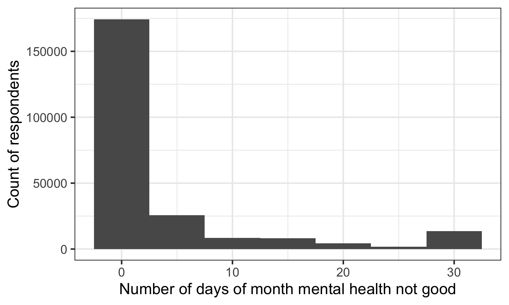
```

```{r top-10-states-num-10-mental-health-bad-days, message = FALSE, echo = FALSE}
read_tsv("../results/top-10-states-low-mental-health-data.tsv") %>%
  kable(format = "latex", row.names = NA,
        booktabs = TRUE, digits = 2,
        col.names = c("State", "Count of respondents with more than 
                      10 bad mental health days"),
        caption = "Top ten states with most respondents with greater than 10 days where their mental health was reported to be not good.") %>%
  kable_styling(position = "center") %>%
  kable_styling(latex_options = "HOLD_position")
```

To further visualize respondents' mental health across the United States, I created a heatmap, as seen in Figure \@ref(fig:response-map), illustrating the response variable across the country, i.e., the number of days that someone's mental health was not good. This map was generated based on a stratified sampling of respondents across all the states represented in the training dataset (since creating the heatmap on the full training dataset was too computationally costly). We can see that Mississippi, Louisiana, and Texas are among states with the worst mental health.

```{r response-map, out.width = "80%", fig.cap = "This is a heat map for the number of days that someone's mental health was not good in the past month.", fig.align='center', fig.pos = "H", echo = FALSE}
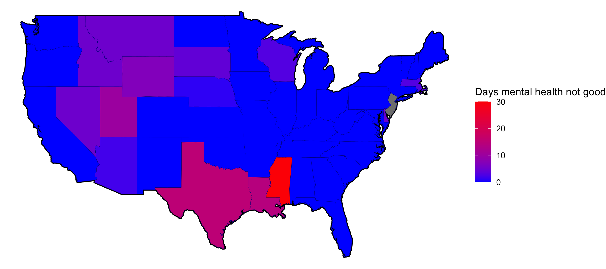
```

Having seen the top 10 states with the most number of respondents with the worst mental health in the past month and further visualized the response variable by state, I wanted to see which were the top 10 states by number of mental health facilities offering mental health diagnostic evaluation. In Table \@ref(tab:top-10-states-mental-health-facilities), we can observe that the states with the most number of such facilities are California, New York, and Ohio.

```{r top-10-states-mental-health-facilities, message = FALSE, echo = FALSE}
read_tsv("../results/top-10-states-mental-health-facilities-data.tsv") %>%
  kable(format = "latex", row.names = NA,
        booktabs = TRUE, digits = 2,
        col.names = c("State", "Number of mental health facilities offering diagnostic evaluation"),
        caption = "Top ten states with most number of mental health facilities with diagnostic evaluation.") %>%
  kable_styling(position = "center") %>%
  kable_styling(latex_options = "HOLD_position")
```

### Features

Given the range of demographic variables as well as variables related to clinical access in the dataset, I wanted to explore how these related to people's reported mental health. In Figure \@ref(fig:mental-health-vs-race), we can observe the proportion of respondents whose mental health was not good for greater than or equal to 15 days in the past month by race (omitting from visualization observations which were Don’t know/Not sure/Refused). We can see multiracial and American Indian or Alaskan Native are racial groups that have the greatest proportion of respondents who have more days than not when their mental health is not good. On the other hand, we can also observe that the Asian and White racial groups, have the lowest proportion of respondents who have more days when their mental health is not good; i.e., comparing across different groups, these racial groups have the greatest proportion of respondents who have fewer than 15 days when their mental health was not good.

```{r mental-health-vs-race, out.width = "80%", fig.cap = "This is a bar plot illustrating the proportion of respondents whose mental health was not good for greater than or equal to 15 days in the past month by race.", fig.align='center', fig.pos = "H", echo = FALSE}
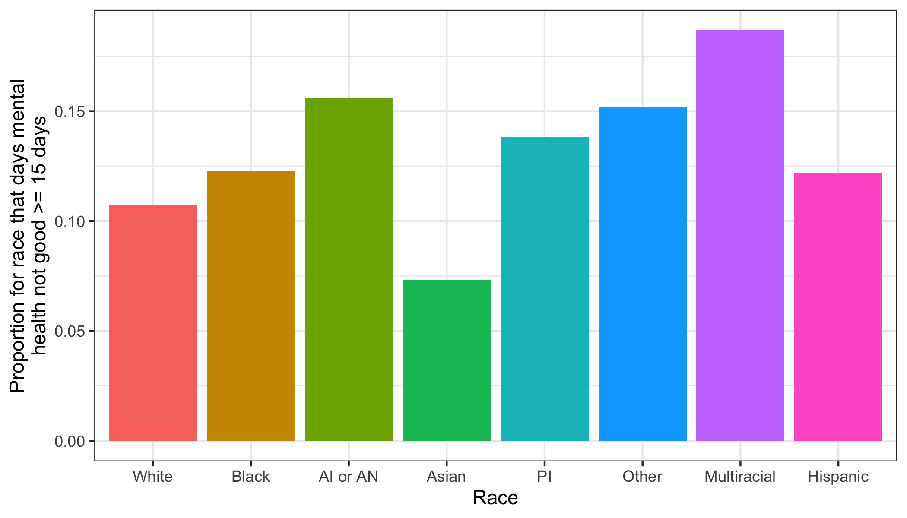
```

Given that the relevance of access to mental health care for predicting reported mental health was something I was interested in further exploring, I wanted to examine the relationship between the mental health response variable and the `med_cost` variable, which reflected whether or not there was a time in the past 12 months when the respondent needed to see a doctor but could not because of cost. I grouped by this variable, i.e., respondents' response to whether or not cost was a barrier, visualizing the proportion of respondents within each group that reported that the number of days that their mental health was not good in the past month was greater than or equal to 15 days. This plot can be seen in Figure \@ref(fig:mental-health-vs-med-cost). Interestingly, the proportion of respondents with greater than or equal to 15 bad mental health days is three times higher for those who reported cost ever being a barrier in the past 12 months for seeing a doctor over those who reported that there was no such cost barrier. However, note that the variable reflecting whether they could not see a doctor because of cost could surely encompass physical or mental challenges. However, given that physical health is often prioritized over mental health, it would make sense that such a barrier could likely apply exclusively for mental health challenges in accessing clinical care.

```{r mental-health-vs-med-cost, out.width = "65%", fig.cap = "This is a plot highlighting the proportion of respondents whose mental health was not good for greater than or equal to 15 days in the past month by whether there was ever an instance in the past year when they could not see a doctor because of cost.", fig.align='center', fig.pos = "H", echo = FALSE}
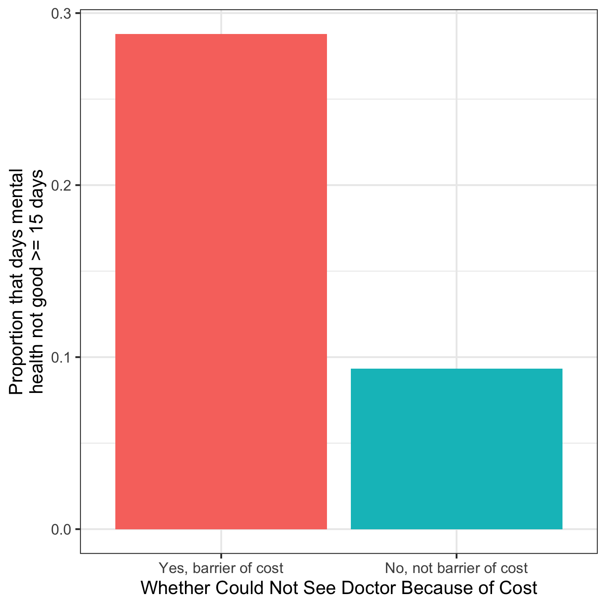
```

I next wanted to explore the relationships among the predictor variables and between predictor variables and the response. Predictor variables are detailed in the Appendix \@ref(appendix). I first examined the correlations among the numeric variables as we can observe in Figure \@ref(fig:corr-among-numeric-variables-plot).

```{r corr-among-numeric-variables-plot, out.width = "80%", fig.cap = "In this plot, we can observe the correlations among numeric variables.", fig.align='center', fig.pos = "H", echo = FALSE}
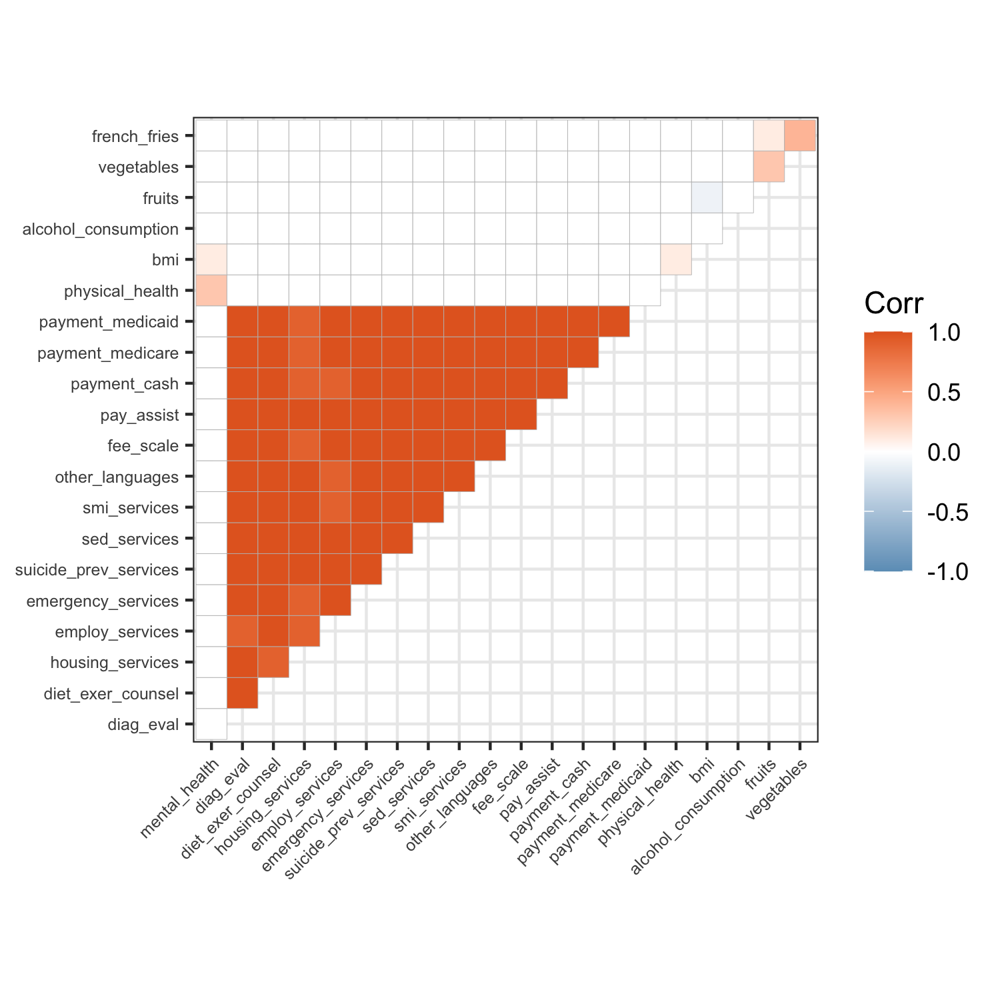
```

We can see that for the mental health facilities in state variables, the features in this category are highly correlated with each other. Recalling that including correlated variables will hurt statistical inference in differentiating between these variables (e.g., the confidence intervals will be wider), but it will not hurt the predictive power (unless variables are perfectly correlated which they are not in this case), I decided to include all of them. Examining the correlations among numeric variables within the health including nutrition category, we can observe a positive correlation between `vegetables` and `fruits`, and between `vegetables` and `french_fries`. The association between vegetables and fruits intuitively makes sense, as we might expect those who eat more vegetables to also eat fruits, given that those are generally both health categories of food. It is interesting that there is a mild positive correlation between vegetable intake and french fry intake. In terms of the correlations between numeric features and the response, we can observe that there is a positive correlation between `mental_health` and `physical_health`.

Having examined the correlations among numeric variables, I then assessed some of the factor * numeric relationships by exploring the distributions of the numeric variables by the levels of the factor variable (making boxplots of a numeric feature for each level of the factors). In Figure \@ref(fig:physical-health-relationships-plot-grid) are relationships between the numeric variables `physical_health` and `bmi` and factor variables `high_blood_pressure` and `diabetes`.

```{r physical-health-relationships-plot-grid, out.width = "100%", fig.cap = "In this plot grid, we can observe some relationships between health related variables: bmi and high blood pressure, bmi and diabetes, physical health and high blood pressure, physical health and diabetes.", fig.align='center', fig.pos = "H", echo = FALSE}
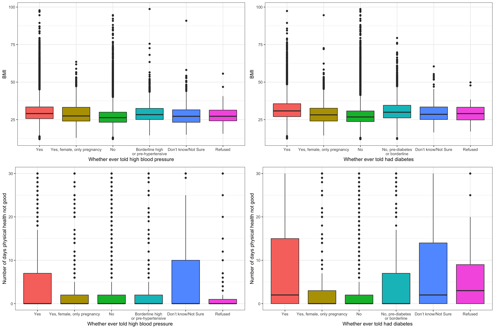
```
Thus, it appears that respondents who have ever been told they have high blood pressure may tend to have slightly higher BMI on average, and similarly, it appears that respondents who have ever been told they have diabetes tend to have higher BMI. We can also observe that for the "No" level for both whether respondents have ever been told they have high blood pressure and whether they have ever been told they have diabetes, the interquartile range for the number of days respondents reported their physical health to not be good is quite small relative to that for the "Yes" level. It appears that those who have never been told they have high blood pressure or those who have never been told they have diabetes tend to have few number of days in the past month when their physical health is not good. These relationships make sense as we would expect people with diabetes or high blood pressure, examples of chronic health conditions, to have higher BMIs and more days out of the past month when their physical health was not good.

I next wanted to explore one of the demographic variables, i.e., age, and its relationship with the response, which is presented in Figure \@ref(fig:mental-health-vs-age-plot). We can observe that there appears to be a decreasing trend in terms of the number of days when one's mental health is not good in the past month and his/her age. This makes sense, as earlier years tend to be a unique and formative time, and physical, emotional and social changes can make young adults vulnerable to mental health problems. Additionally, social media may certainly be related to this trend.^[Social Media and adolescents' and Young Adults' mental health. National Center for Health Research. (2021, October 18). https://www.center4research.org/social-media-affects-mental-health/]

```{r mental-health-vs-age-plot, out.width = "100%", fig.cap = "In this plot, we can observe the relationship between the number of bad mental health days reported in the past month and age.", fig.align='center', fig.pos = "H", echo = FALSE}
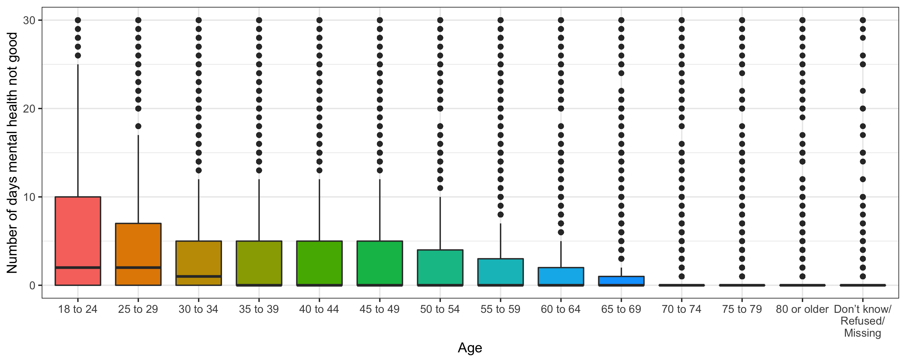
```

As illustrated in Figure \@ref(fig:mental-health-vs-depression-plot), I also wanted to closely examine the variable `depression` and its relationship with `mental_health`. As we can see, the interquartile range extends to far higher values of the `mental_health` variable for respondents who reported they have ever been told they have a depressive disorder compared to those who reported they have not.

```{r mental-health-vs-depression-plot, out.width = "70%", fig.cap = "In this plot, we can observe the relationship between the number of bad mental health days reported in the past month and whether someone was ever told he/she had a depressive disorder.", fig.align='center', fig.pos = "H", echo = FALSE}
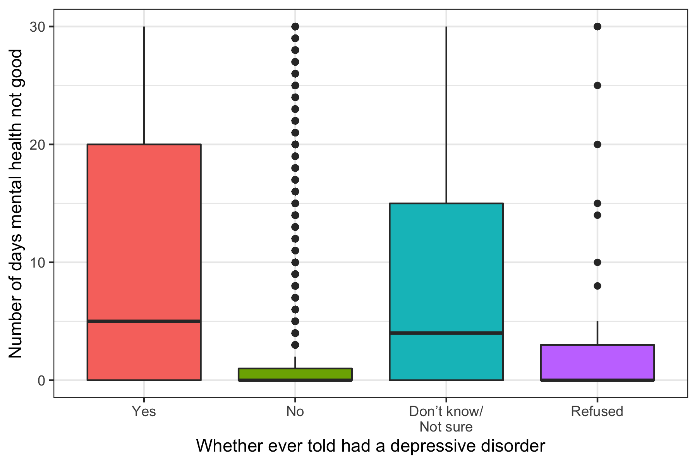
```
Having more closely examined the variable `depression`, I decided to omit this feature for modeling. I made this decision because this variable reflected whether someone was ever told they have a depressive disorder, which to me would not be meaningful to use in predicting one's mental health status. In making this decision, I considered that I might not have access to such a variable when trying to deploy these sorts of models for prediction in practice, and the association of this variable with the response I do not think would be considered very meaningful, but rather somewhat circular.

# Modeling

## Regression-based methods

### Ordinary least squares

I began my analysis with an ordinary least squares regression of bad mental health days on all 50 explanatory variables (i.e., which excludes state). The OLS regression revealed that the following variables are significantly associated with the response at the 0.01 level (note that a factor variable is included in this list if any of its levels are statistically significant at the 0.01 level): number of mental health facilities in state that offer diagnostic evaluation, number of mental health facilities in state that offer supported employment services, number of mental health facilities in state that accept Medicaid as source of payment for mental health treatment services, sex, urban status, marital status, education, whether owns or rents their home, veteran status, employment status, number of children in household, income, race, age, whether deaf, whether blind, whether has any kind of health care coverage, whether reported cost as barrier to seeing doctor, length of time since last checkup, whether tested for HIV, whether cholesterol checked within past five years, whether has one person they think of as their personal doctor or health care provider, number of bad days of physical health in past month, whether high blood pressure, whether high cholesterol, whether told has diabetes, BMI, smoker status, alcohol consumption, exercise activity, strength activity index, fruit intake, vegetable intake, french fry intake, whether ever diagnosed with stroke, and whether has asthma.

The multiple R-squared indicates that these features explain 21.4% of the variation in response. Note: I additionally explored an OLS regression with a log-transformed response. However, when I used this model to predict the training data, i.e., obtained the training error, it was worse than that for the non-transformed response (and this was also the case for the penalized regression methods including ridge). (This makes sense because plotting the distribution of the transformed response was still heavily skewed.) Thus, I decided to continue my modeling on the original (untransformed) response variable. (Additionally, plotting the distribution of the residuals for the linear fit did not appear heavily right-skewed.) See the Appendix \@ref(appendix) for the linear regression model summary.

Note that correlation among features does not impact the interpretability of linear regression p-values, whether for the highly correlated features within the mental health facilities category or for others. The consequence of correlation is that if a group of features are correlated enough with each other, then none of them will be statistically significant. The linear regression thus accounts for statistical uncertainty, including uncertainty induced by feature correlation. This contrasts with methods like the lasso and others applied subsequently which do not come with p-values, so we do not have a formal way to quantify the confidence of the selected features.

### Penalized regression

I next wanted to try out penalized forms of regression, as fitting a linear model with many explanatory variables may incur a large cost in variance and lead to suboptimal predictions. However, given that my training set has so many observations, I was not really expecting to see improved performance from these models, yet was interested to try out shrinkage models in developing a parsimonious and interpretable model. I ran three cross-validated regressions for which optimal values of lambda were chosen according to the one-standard-error rule: ridge, lasso (Least Absolute Shrinkage and Selection Operator), and elastic net.

Thus, for the penalized regression methods, I first fit a 10-fold cross-validated ridge regression to the training data. Figure \@ref(fig:ridge-cv-plot) shows the CV plot and Figure \@ref(fig:ridge-trace-plot) shows the trace plot, with the top six features highlighted in color. In Figure \@ref(fig:ridge-cv-plot), the CV plot, corresponding to the right vertical dashed line on the plot (on the log scale), the value of lambda selected according to the one-standard-error rule is 1.42.

```{r ridge-cv-plot, out.width = "80%", fig.cap = "This is the CV plot for the 10-fold cross-validated ridge regression model on the training data.", fig.align='center', fig.pos = "H", echo = FALSE}
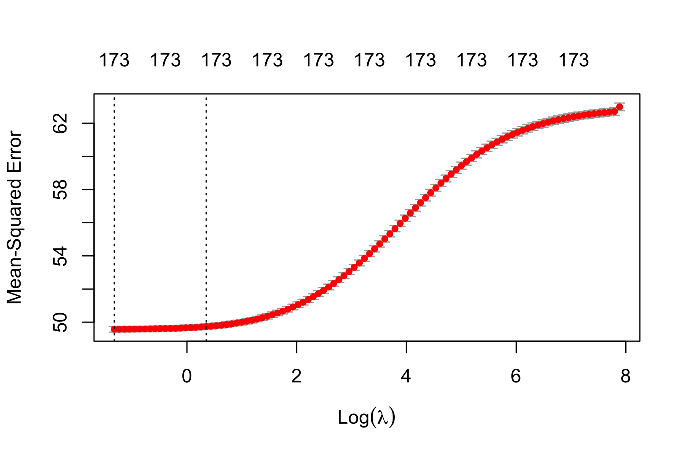
```

In Figure \@ref(fig:ridge-trace-plot), we can visualize the ridge regression fitted coefficients, highlighting 6 features. We can observe that for all highlighted features, their coefficient magnitude increases monotonically as lambda decreases. The highlighted levels of features read from left to right and top to bottom correspond to `age`: 18-24, `employment`: unable to work, `med_cost`: no, age: 80 or older, `med_cost`: yes, `physical_health`.

```{r ridge-trace-plot, out.width = "80%", fig.cap = "This is the trace plot for the ridge regression model, visualizing the ridge regression fitted coefficients, highlighting 6 features.", fig.align='center', fig.pos = "H", echo = FALSE}
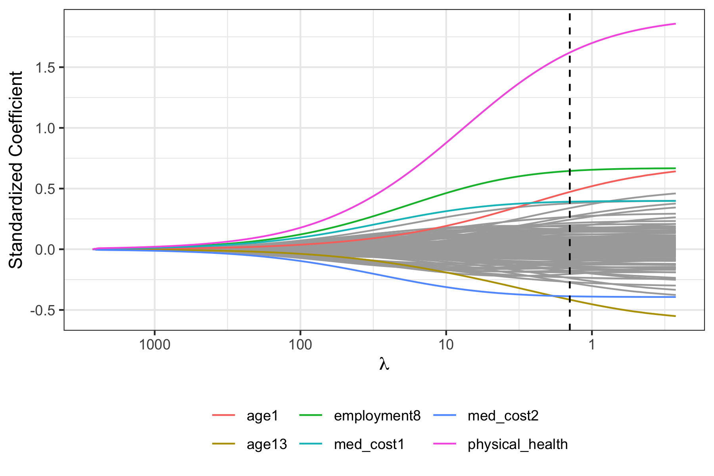
```

I then fit a a 10-fold cross-validated lasso regression to the training data. Figure \@ref(fig:lasso-cv-plot) shows the CV plot, Figure \@ref(fig:lasso-trace-plot) shows the trace plot, and Table \@ref(tab:top-10-lasso-coefficients) shows the top ten selected features and their standardized coefficients. In Figure \@ref(fig:lasso-cv-plot), which displays the lasso CV plot, corresponding to the right vertical dashed line on the plot, the value of lambda selected according to the one-standard-error rule is 0.0534. The number of features (note this is with levels of factors separated out into their own variables) (excluding the intercept) that are selected if lambda is chosen according to the one-standard-error rule is 62.

```{r lasso-cv-plot, out.width = "80%", fig.cap = "This is the CV plot for the 10-fold cross-validated lasso regression model on the training data.", fig.align='center', fig.pos = "H", echo = FALSE}
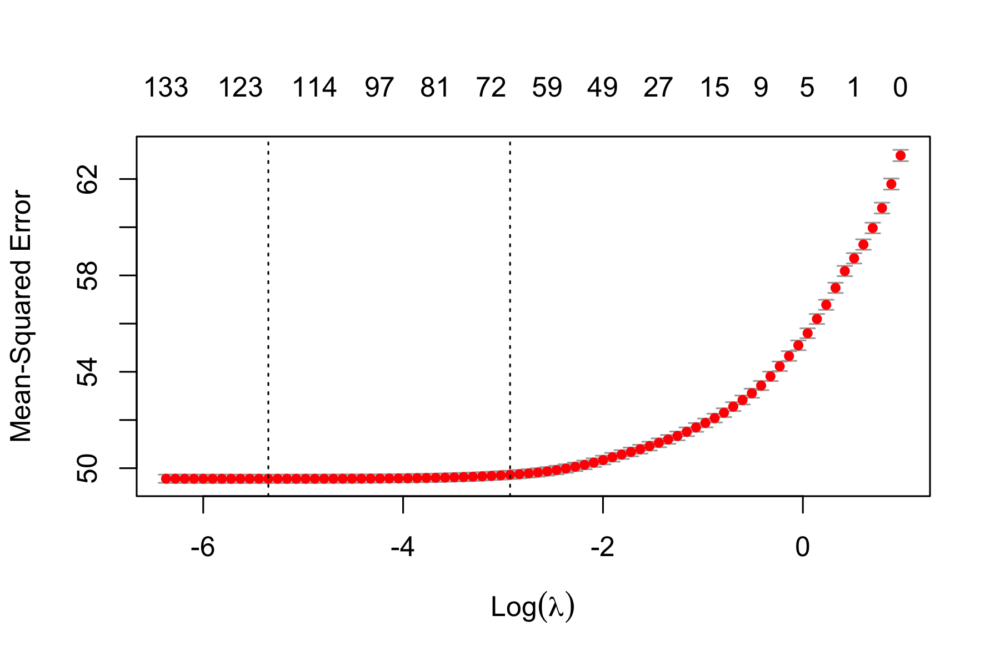
```

We can observe the top ten (selected) features with nonzero standardized coefficients in Table \@ref(tab:top-10-lasso-coefficients).

```{r top-10-lasso-coefficients, message = FALSE, echo = FALSE}
read_tsv("../results/lasso-features-table.tsv") %>% 
  head(10) %>%
  kable(format = "latex", row.names = NA,
        booktabs = TRUE, digits = 4,
        col.names = c("Feature", "Coefficient"),
        caption = "These are the top ten nonzero standardized coefficients 
        from the lasso model based on a value for lambda determined by 
        the one-standard-error rule.") %>%
  kable_styling(position = "center") %>%
  kable_styling(latex_options = "HOLD_position")
```

Thus, the features selected by the lasso model are number of bad physical health days, employment: unable to work, age: 18-24, sex: male, existence of incident where cost was barrier to seeing doctor (med_cost: yes), smoker status: current smoker - now smokes every day, age: 80 or older, age: 25-29, not any incident where cost was barrier to seeing doctor (med_cost: no), age: 30-34. Additionally, for example, we can observe that if the predictor number of bad physical health days increases by one standard deviation, the number of bad mental health days increases by about 2.

In Figure \@ref(fig:lasso-trace-plot), I visualized the lasso regression fitted coefficients, which highlights 6 features in color. Examining this lasso trace plot, we can observe that lambda decreases from left to right. We can see that `physical_health`, which is the number of days someone's physical health was not good in the past month, is the first feature to enter the model as lambda decreases (by examining the far left of the plot and seeing how `physical_health` becomes non-zero earliest as we move right). We can also observe that the two features that have the largest absolute coefficients for the most flexibly fitted lasso model are `physical_health` and `employment`: unable to work, as note that the most flexibly fitted lasso model corresponds to the model with the lowest lambda. Thus, looking at the far right of the plot, we can see that the features that have the largest absolute coefficients here are `physical_health` and `employment`: unable to work. Thus, interestingly, the feature that is both the first to enter the model as lambda decreases and the largest absolute coefficient for the most flexibly fitted lasso model is `physical_health`, i.e., the number of days someone's physical health was not good in the past month.

```{r lasso-trace-plot, out.width = "80%", fig.cap = "This is the trace plot for the lasso regression model, visualizing the lasso regression fitted coefficients.", fig.align='center', fig.pos = "H", echo = FALSE}
knitr::include_graphics("../results/lasso-trace-plot.png")
```

I then fit a a 10-fold cross-validated elastic net regression to the training data. I found that the minimum CV error was at the alpha value of 0.729. See the Appendix \@ref(appendix) for this CV plot (specifically Figure \@ref(fig:elnet-cv-error-alpha-plot)). Figure \@ref(fig:elnet-cv-plot) shows the CV plot based on different values of lambda, Figure \@ref(fig:elnet-trace-plot) shows the trace plot, and Table \@ref(tab:top-10-elnet-coefficients) shows the top ten selected features and their standardized coefficients. In Figure \@ref(fig:elnet-cv-plot), which displays the elastic net CV plot, corresponding to the right vertical dashed line on the plot, the value of lambda selected according to the one-standard-error rule is 0.0733. The number of features (excluding the intercept) that are selected if lambda is chosen according to the one-standard-error rule is 65.

```{r elnet-cv-plot, out.width = "80%", fig.cap = "This is the CV plot for the 10-fold cross-validated elastic net regression model on the training data.", fig.align='center', fig.pos = "H", echo = FALSE}
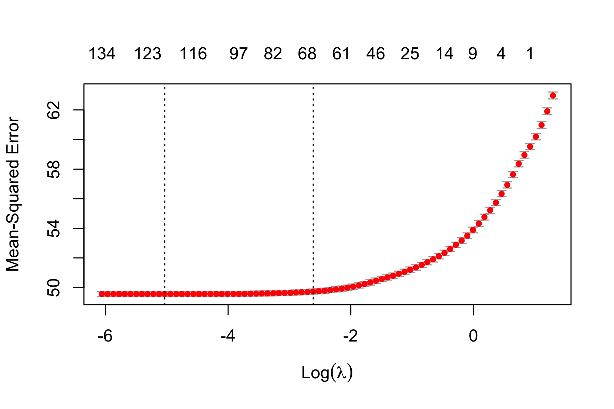
```
Observing the top ten (selected) features with nonzero standardized coefficients in Table \@ref(tab:top-10-elnet-coefficients), we can see that the top ten features are the same as those for the lasso model, but the relative ordering is different.

```{r top-10-elnet-coefficients, message = FALSE, echo = FALSE}
read_tsv("../results/elnet-features-table.tsv") %>% 
  head(10) %>%
  kable(format = "latex", row.names = NA,
        booktabs = TRUE, digits = 4,
        col.names = c("Feature", "Coefficient"),
        caption = "These are the top ten nonzero standardized coefficients 
        from the elastic net model based on a value for lambda determined by 
        the one-standard-error rule.") %>%
  kable_styling(position = "center") %>%
  kable_styling(latex_options = "HOLD_position")
```

In Figure \@ref(fig:lasso-trace-plot) are the visualized elastic net regression fitted coefficients, highlighting 6 features in color. We can see that the plot appears quite similar to that for the lasso regression model. This perhaps makes sense given the rather large (somewhat near to 1) alpha value of 0.729.

```{r elnet-trace-plot, out.width = "80%", fig.cap = "This is the trace plot for the elastic net regression model, visualizing the elastic net regression fitted coefficients.", fig.align='center', fig.pos = "H", echo = FALSE}
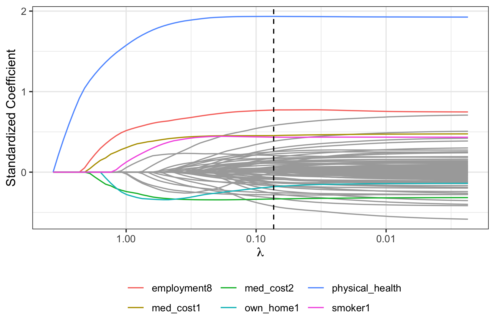
```

## Tree-based methods

### Decision tree

I then began my exploration of tree-based modeling on the data by fitting a decision tree. My goal was to get some more insight into the relationships between the features and the response. I first determined the optimal tree size, finding a tree of optimal size via pruning and cross-validation. I thus first fit the deepest possible tree and determined the number of splits for the optimal tree based on using the one-standard-error rule (after plotting the CV error based on information in the CP table). See the appendix for the plot of the CV error (specifically Figure \@ref(fig:deepest-tree-cv-plot)). The number of splits for the optimal tree is 43. I extracted this optimal tree and used it for prediction on the test set.

A plot of the optimal tree is provided in the Appendix \@ref(appendix), specifically Figure \@ref(fig:optimal-tree-plot). Interestingly, the first split point is based on the variable physical health, corresponding to whether someone has had greater than (or equal to) or less than 9 days where his/her physical health was not good in the past month. Furthermore, the next split points closest to the top of the tree are for the variables age and employment.

### Random forest

I then proceeded to fit a random forest to the data. As mentioned earlier, I had to use a fraction of my training dataset for the random forest and boosting methods due to my computational limitations. Even trying to run random forest on 5% of my data was taking several hours without terminating, so I took 1% of my training data for building these latter two types of models (seeing that the data was randomized such that I could take random dices with the distribution of the response being approximately the same).

While bagging is achieved when all 50 variables are considered at each tree split, leading to higher variance and suboptimal prediction performance, I tuned the random forest model to find the optimal value of m, or the number of features to consider at each tree split, training the model on five different values of m, ranging evenly between 1 and 50. The out of bag error for each value of m can be observed in Figure \@ref(fig:oob-error-vs-m-plot). I thus made a plot of OOB error versus m, and identified the best value of m: We can observe that the out of bag error is minimized at a value of m = 26, after which the error increases. (Note that in order to determine a reasonable number of trees to use when tuning the value of m, I plotted OOB error as a function of number of trees upon training a random forest with default settings. Based on this OOB error plot, I had found that a reasonable number of trees to grow without significantly compromising prediction accuracy is 100, as at this point, the OOB error had stabilized. This is the value for the number of trees I used to reduce computational demands for tuning without significantly compromising prediction accuracy.)

```{r oob-error-vs-m-plot, out.width = "65%", fig.cap = "This is the plot of OOB error versus m for different values of m.", fig.align='center', fig.pos = "H", echo = FALSE}
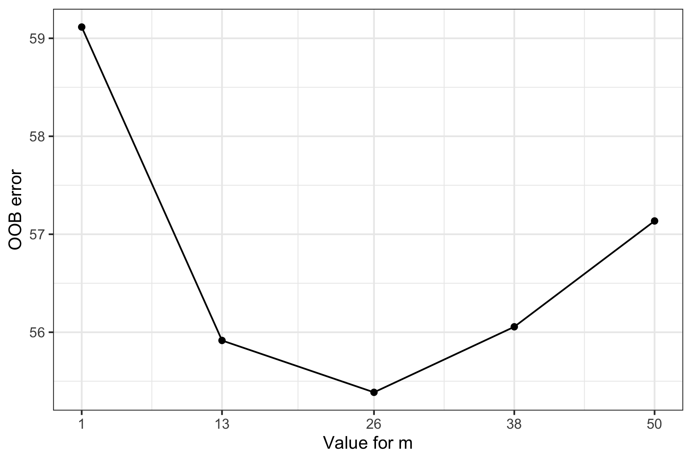
```

Using the optimal value of m, I trained a random forest on 500 trees, plotting the OOB error as a function of the number of trees, making sure the OOB error had flattened out. In Figure \@ref(fig:oob-error-vs-ntrees-plot), I have the OOB error plotted as a function of the number of trees. As seen in the plot, it appears that the error has flattened out. That is, the cross-validated training error sharply decreases as the number of trees increases and then plateaus starting at around B = 100 or so. That is, this error stays flat as soon as the number of trees is large enough. We can see that the OOB error has certainly stabilized by 500 trees.

```{r oob-error-vs-ntrees-plot, out.width = "65%", fig.cap = "This is the plot of the OOB error as a function of the number of trees for the tuned random forest fit.", fig.align='center', fig.pos = "H", echo = FALSE}
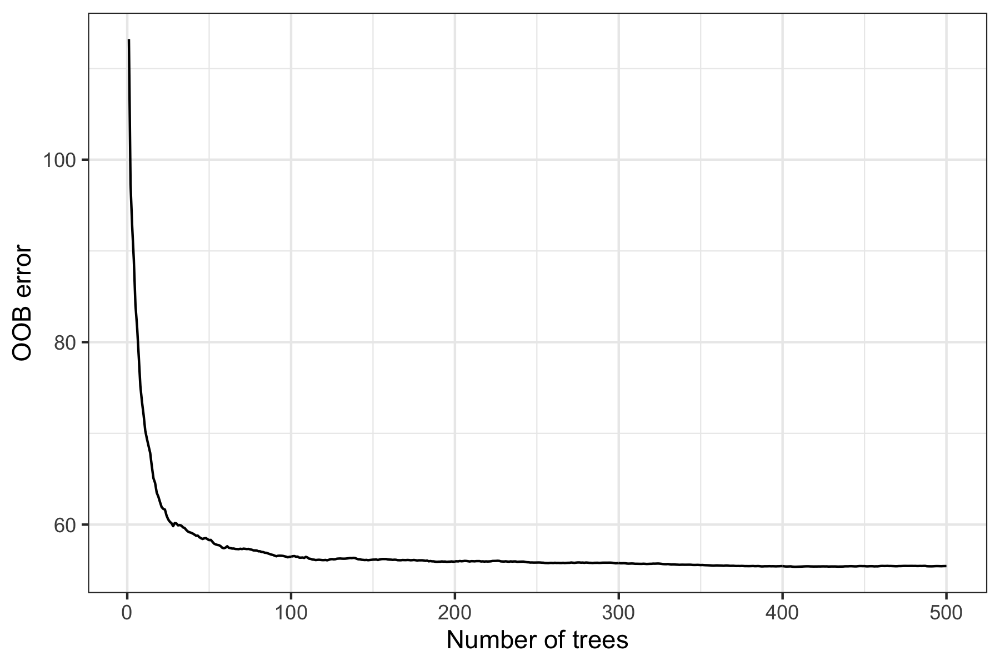
```

I next wanted to be able to better interpret the random forest ultimately used to make predictions by producing the variable importance plot for the random forest trained on the optimal value of m, as shown in Figure \@ref(fig:rf-var-importance-plot).

Assessing variable importance, in this random forest context, there are two notions of variable importance: purity based importance and OOB variable importance. OOB variable importance is a measure of the deterioration in prediction accuracy that results from scrambling a given feature out of bag. In particular, %IncMSE is a measure of the increase in MSE of predictions (estimated with out-of-bag-CV) as a result of variable j being permuted (values randomly shuffled). Purity based importance is a measure of the degree of improvement in node purity that results from splitting on a given feature. IncNodePurity, i.e., increase in node purity, is calculated based on the reduction in sum of squared errors whenever a variable is chosen to split. The results of both of these variable importance measures are summarized in Figure \@ref(fig:rf-var-importance-plot).

```{r rf-var-importance-plot, out.width = "75%", fig.cap = "This is the variable importance plot for the random forest trained on the optimal value of m.", fig.align='center', fig.pos = "H", echo = FALSE}
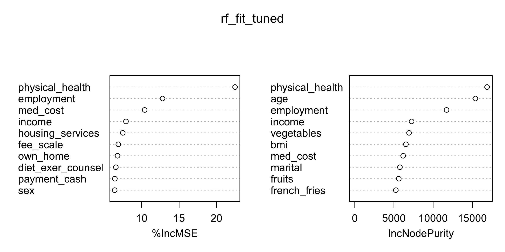
```

In order, the top three features for the left plot in Figure \@ref(fig:rf-var-importance-plot) are `physical_health`, `employment`, and `med_cost` (by the %IncMSE metric). For the right plot in Figure \@ref(fig:rf-var-importance-plot), the (ordered) top three features are `physical_health`, `age`, and `employment` (by the node purity metric). Note that while `housing_services`, `fee_scale`, `diet_exer_counsel`, and `payment_cash` appear among the top 10 variables based on the %IncMSE metric, due to the high correlation among the subset of features corresponding to the variables in the mental health facilities counts category, it could be the case that these variables are among the most important or other mental health facilities aggregated variables are among the most important, i.e., other variables in that subset. Also note that the interpretations for only the correlated variables are affected. For the correlated variables, we thus can still interpret things with the caveat that it might be either the variable presented or one of the other ones in its highly correlated group.

Thus, examining this figure, we can observe that physical health has high importance as measured by both metrics. We can also see that employment status, whether one could not see a doctor due to cost, and income are present among the top 10 for both metrics as well. This suggests that such variables are important in this model for predicting respondents' reported number of days that their mental health was not good in the past month.


### Boosting

Boosting is another state-of-the-art prediction method, where the algorithm learns by fitting the residual of the trees that preceded it. Thus, I next fit a boosted model. I focused on tuning the interaction depth of the model, testing interaction depths of 1, 2, 3, and 4 (all else equal). That is, I fit boosted tree models with interaction depths 1, 2, 3, and 4, for each, using a shrinkage factor of 0.1, 1000 trees, and 5-fold cross-validation.

I then plotted the CV errors against the number of trees for each interaction depth as seen in Figure \@ref(fig:cv-errors-vs-ntrees-vary-depth-plot) (with horizontal dashed lines at the minima of these four curves).

```{r cv-errors-vs-ntrees-vary-depth-plot, out.width = "90%", fig.cap = "This is a plot of the CV errors against the number of trees for each interaction depth, i.e., 1, 2, 3, and 4. Also plotted are horizontal dashed lines at the minima of these four curves.", fig.align='center', fig.pos = "H", echo = FALSE}
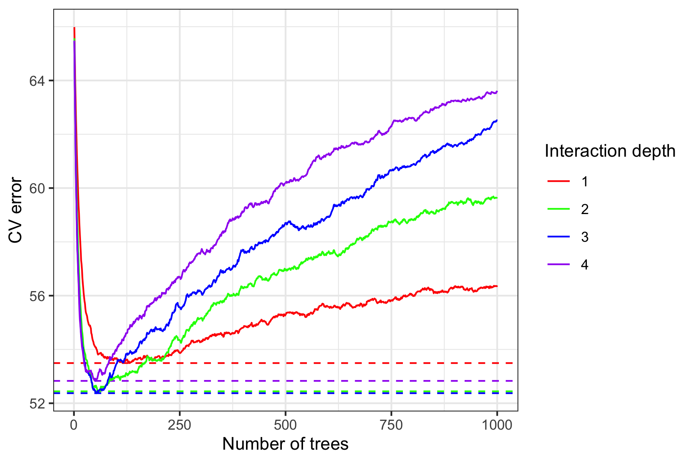
```

From Figure \@ref(fig:cv-errors-vs-ntrees-vary-depth-plot), we can see that the optimal interaction depth is 3, and the corresponding optimal number of trees is precisely 53. That is, from the cross validation plot, we observe that the model with an interaction depth of 3 attains the minimum cross validated error, with 53 trees.

With the tuned boosted model, I then assessed variable importance through purity-based importance (defined above in random forest) using the results of the relative influence table as well as partial dependence plots. First, we can examine the results of purity-based importance, ranking the top ten variables by their contributions to improvements in node purity. In Table \@ref(tab:boosting-relative-influence-table) are the first ten rows of the relative influence table for the optimal boosting model.

```{r boosting-relative-influence-table, message = FALSE, echo = FALSE}
read_tsv("../results/boosting-relative-influence-table.tsv") %>%
  kable(format = "latex", row.names = NA,
        booktabs = TRUE, digits = 4,
        col.names = c("Feature", "Coefficient"),
        caption = "These are the first ten rows of the relative influence 
        table for the optimal boosting model.") %>%
  kable_styling(position = "center") %>%
  kable_styling(latex_options = "HOLD_position")
```

From Table \@ref(tab:boosting-relative-influence-table), we see that the top four features are `physical_health`, `age`, `employment`, and `med_cost`. For the random forest trained above, the top four features based on the IncNodePurity measure of importance were `physical_health`, `age`, `employment`, and `income`, as seen in Figure \@ref(fig:rf-var-importance-plot). Thus, `physical_health`, `age`, and `employment` are top features across both models and we can observe that many of these variables overlap with those reflected in the top features for random forest, e.g., `med_cost`, `income`, `marital`, and `fruits`. In fact, seven variables in the top ten for this boosting model are among the top ten variables for random forest based on the IncNodePurity measure. Thus, while the top features for the boosting model, and the ordering, do not perfectly align with the top features of the trained random forest model, there is certainly overlap.

I next produced partial dependence plots for the most important four features based on relative influence (i.e., `physical_health`, `age`, `employment`, and `med_cost`), as shown in Figure \@ref(fig:partial-dependence-plots). Because the optimal interaction depth for the boosting model is 3, these plots estimate the approximate relationship of the four individual variables with the response variable.

```{r partial-dependence-plots, out.width = "95%", fig.cap = "These are partial dependence plots for the top four features based on relative influence. The plot for the number of days in the past month one's physical health was not good appears in the top left, the plot for employment status appears in the top right, the plot for age appears in the bottom left, and the plot for whether one needed to see a doctor but could not because of cost appears in the bottom right.", fig.align='center', fig.pos = "H", echo = FALSE}
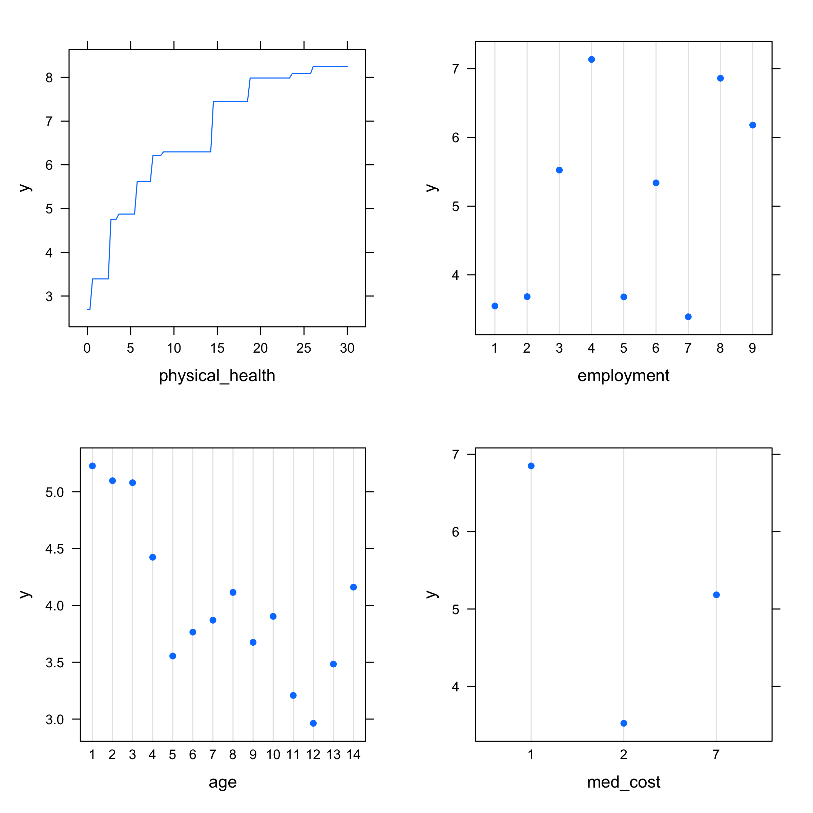
```

We can observe that for the variable `physical_health`, there is an increasing relationship with `mental_health`. That is, as the relative measure of the number of bad physical health days in the past month increases, we see a relatively consistent increase in the number of bad mental health days, with noticeable jumps at a number of days of around 2 and 15. For the `employment` variable, we can observe that the levels 4 and 8, corresponding to "Out of work for less than 1 year" and "Unable to work" respectively, are related to more days of bad mental health in the past month, whereas the levels 1, 2, 5, and 7, corresponding to "Employed for wages", "Self-employed", "A homemaker", and "Retired", are related to fewer bad mental health days in the past month. Perhaps it would be interesting to further explore the reason for some respondents being unable to work and its relation to mental health, as a non-insignificant 16230 respondents in the full training dataset reported being unable to work.

For the `age` variable, there appears to be a somewhat decreasing relationship with `mental_health`, for as the approximate age/range corresponding to an age level increases, the number of bad mental health days decreases (however, with an increase for age 80 or older). Perhaps even more interestingly, observing the partial dependence plot for `med_cost`, there is a large difference between the response for an affirmative (level 1) vs. non-affirmative (level 2) response to the question "Was there a time in the past 12 months when you needed to see a doctor but could not because of cost?". This suggests that those for which cost is a barrier to seeing a doctor tend to have more days in the past month when their mental health was not good.

Taken together, these factors suggest that people with worse physical health, people out of work recently or unable to work, people who are younger, and those for whom cost is a barrier to access health care may have more frequent challenges with their mental health. Such factors like cost as a barrier to access could perhaps also have made mental health resources more difficult to access, thus leading to additional mental health struggles. Additionally, it is possible that poor physical health can both worsen mental health due to the challenges that arise in dealing with a physically unwell body and also be deteriorated by poor mental health related to e.g., inactivity related to experiencing depression.


# Conclusions

## Method comparison

I calculated the root mean squared test errors of the linear model, ridge regression, lasso regression, elastic net regression, decision tree, random forest, and boosting model on the test dataset, which are presented in Table \@ref(tab:test-model-evaluation). Note that the computation was done for ridge, lasso, and elastic net using the value of lambda according to the one-standard-error rule. Of the models, the linear regression model has the least test error. Note that since these are RMSEs, they can be interpreted on the scale of the response variable: my predictions are on average about seven days off from the true number of days someone reported his/her mental health to not be good in the past month.

```{r test-model-evaluation, message = FALSE, echo = FALSE}
read_tsv("../results/test-model-evaluation.tsv") %>%
  kable(format = "latex", row.names = NA,
        booktabs = TRUE, digits = 2,
        caption = "These are the root mean squared test 
        errors of the models fitted. This table includes 
        an intercept-only model for comparison.") %>%
  kable_styling(position = "center") %>%
  kable_styling(latex_options = "HOLD_position")
```
As for the regression models, we may suspect that bias (rather than variance) is the dominant force in driving the test error in this data. We can observe from the shape of the CV curves for ridge, lasso, and elastic net that higher values for lambda are contributing to higher mean-squared error. We can see this in the CV plots, as for larger values of lambda, the error increases. Thus, it makes sense that of the regression models, the linear model performs best (as lambda = 0), and we are not acting to reduce the variance, trading variance off for higher bias, as we are with ridge and lasso (and elastic net). (Also, in the lasso CV plot, we can see that we are not improving the model by shrinking and selecting a smaller subset of features, as there does not appear a point where this increase in bias is enabling us to have a lower test error based on the reduction in variance.) Least squares has the highest variance and is performing best, so it would make sense that bias is the dominant force in driving the test error in the data. Furthermore, the sample size $n$ is fairly large relative to the number of features, so this suspicion makes sense, for as $n$ is larger, we can worry less about variance (as variance is inversely proportional to the sample size). Thus, given that the ridge, lasso, and elastic net models perform worst of the regression models, it makes sense to suspect that bias is a bigger issue relative to variance; moreover, the ratio of sample size to features (certainly many factors more than ten times larger) is big enough so that variance is not as much of an issue.

As for the tree-based models, we can observe that the decision tree and boosting perform best compared to random forest. The decision tree likely performs as well as it does in part because it was able to be trained on the entire training set. The complexity of a tree increases with the number of terminal nodes, and so with 43 splits, the tree can perhaps somewhat flexibly fit the training data. When it comes to prediction accuracy, trees suffer because of their high variance. However, bias seems to be the main issue influencing test error rather than variance here. As for random forest, by averaging a bunch of trees, we are reducing the variance while keeping the bias about the same. Thus, it makes sense why random forests may not produce better results in this context. While random forests grow deep decision trees in parallel, for boosting, we grow shallow decision trees sequentially. Boosting reduces error mainly by reducing bias by increasing the expressive power of the base learner (and also to some extent variance, by aggregating the output from many models); on the other hand, random forest uses fully grown decision trees. It tackles the error reduction task by reducing variance. Thus, it makes sense that boosting performs relatively better, as it is able to better tackle bias. Additionally, it makes sense that random forest's error and the boosting model's error are rather high compared to regression methods given that it was only able to be trained on a subset of the training data due to computational limitations. Thus, it is perhaps almost guaranteed that boosting would perform best if the model were to be trained on the entire training set.

Regardless of the differences in test RMSE, the methods overlap significantly in their identification of important variables from the larger set of features. For instance, the lasso regression selects the following variables, which are also deemed significant in the OLS model: number of bad days of physical health in past month, employment status, age, whether reported cost as barrier to seeing doctor, smoker status, sex, marital status, whether has asthma, whether tested for HIV, whether owns or rents home, whether high cholesterol, whether blind, alcohol consumption, race, exercise activity, income, BMI, strength activity index, whether deaf, french fry intake, urban status, education, whether cholesterol checked within past five years, whether had stroke, fruit intake, whether has diabetes, vegetable intake, whether has any health care coverage.

The random forest and boosting models both include number of bad days of physical health in past month, age, employment status, whether reported cost as barrier to seeing doctor, income, marital status, and fruit intake in the top 10 most important variables, as measured by their contributions to node purity.

In the Appendix \@ref(appendix), specifically Table \@ref(tab:train-model-errors), I have included the training errors for these models. Given that the RMSE metrics for training and testing are rather close to one another, this does not suggest there is any gross overfitting at all occurring. If there was overfitting, the test error would be significantly higher than the training error, which in such a case would suggest I was building a model that adapted too much to the wiggles in the training data. 

We can observe that all models perform better than an intercept-only model, which would be predicting 3.78 (the mean for `mental_health` in the training data). The better performance over the intercept-only model is only approximately one day based on the scale of the response variable. As training and test errors are rather high, this seems to largely be a reflection of the limited predictive power of these features for the number of days when one's mental health was not good in the past month (with limited ability to capture the underlying trend in the data). However, given that there are certainly fewer occurrences of people with a greater number of bad mental health days in the data, such a small improvement in predictive performance through these models can perhaps aid in capturing the differences for those people closer to the end of the spectrum.

## Takeaways

While the predictive power of my models is limited, the results point to a few key determinants of mental health that community organizers and policymakers should consider when aiming to improve community well-being and also potentially help mitigate the risk of future mental health struggles. All models pointed to physical health as being an important variable in predicting an individual's number of days when his/her mental health was not good in the past month. Mental health and physical health are closely connected. Mental health plays a major role in one’s ability to maintain good physical health, as mental illness, e.g., depression and anxiety, affect one’s ability to participate in health-promoting behaviors. In turn, problems with physical health, e.g., chronic diseases, can have a serious impact on mental health and decrease one’s ability to participate in treatment and recovery. In that regard, it is unsurprising that this factor would have the greatest ability of the features to predict the number of days when one's mental health was not good in the past month. 

An individual's age, employment status, and whether there was a time in the past 12 months when one needed to see a doctor but could not because of cost were also highly important variables in these models (including the best performing mode, the linear model). Such variables are identified across all models, suggesting these relationships are somewhat robust. Younger people, those who are out of work or unable to work, and those who reported a time when cost was a barrier when one needed to see a doctor are more likely to have a greater number of days when their mental health is not good. The latter two variables relate to an individual’s ability to access and pay for healthcare, including mental healthcare (yet the fact that employment was more predictive than income perhaps also suggests the sense of purpose work can provide that contributes to one's mental health). It makes sense that people's mental health would potentially be worse for those who lack access to affordable resources. Other influential demographic and health-related variables include smoker status, marital status, and whether one owns or rents their home.

People's mental health thus in part appears to reflect one's physical health, age, employment status, and reality of healthcare accessibility. Given the complexity of one's mental health status and the restricted predictive power of my models, I am limited in making conclusions about the true predictive capacity of any of the top factors identified. Nonetheless, perhaps these results which consider many socio-economic and health determinants and highlight a certain subset that are relevant, can help inform policy-makers and organizers of community programs directed toward improving various determinants of mental health outcomes in the U.S.

Perhaps these results can serve to encourage community organizers, and any and all who can help to influence other people in a positive way, to encourage healthier lifestyles, reduced alcohol consumption and smoking, greater exercise and food choices. Perhaps one of the most important things is ensuring there are outlets for people who are at risk of falling into these habits and tendencies to seek help affordably and openly. These results seem to also suggest the importance of being aware of certain communities like young people, those divorced or widowed, and people of lower income status who may be at greater risk. Perhaps these results may even suggest that healthcare companies should incentivize certain healthy lifestyle behaviors that can potentially minimize the cost of mental healthcare and discourage other behaviors.

In the midst of a mental health pandemic, it is important to reflect upon how certain communities and subgroups of people may be at greater risk than others. My results suggest that some vulnerabilities may include greater alcohol consumption, smoking, infrequent exercise, poor diet (less healthy food intake including fruits and vegetables and greater intake of fast food like french fries). The identification of people who engage in such behaviors can perhaps serve as a mild warning for vulnerability to greater mental health challenges. Additionally, it appears that some populations may be at greater risk including those who are younger on average, those recently out of work or unable to work, those who are divorced or widowed, blind, as well as those with lower income. These analyses can help serve to protect already vulnerable communities from suffering disproportionately in the future.

Moreover, given that there are certainly fewer observations with a greater number of bad mental health days, such a small improvement in predictive performance through these models built can perhaps aid in capturing the differences for those people closer to the end of the spectrum. Also, to the extent that I was interested in exploring an array of variables specifically related to demographics, healthcare access, and physical health and nutrition, this analysis provides a means of narrowing in on those variables within that range of factors that reveal themselves to be related to one's mental health.

## Limitations

In initially cleaning and exploring the data, I had discovered that there were additional variables, which I had originally intended to include as features for predictive modeling, but that were limited to the responses of only a fraction of states in the United States. That is, only a fraction of responses from certain states included these measures in individual's responses to the BRFSS survey. Yet I knew I wanted to ensure representativeness across the U.S. (Nonetheless, somewhat interestingly as well, no respondents from the state of New Jersey are represented at all. This is because this was the only state not conducting surveillance that year. In particular, New Jersey was unable to collect enough BRFSS data in 2019 to meet the minimum requirements for inclusion in the 2019 annual aggregate data set.^[2019 BRFSS Survey Data and Documentation. (n.d.). https://www.cdc.gov/brfss/annual_data/2019/pdf/overview-2019-508.pdf]) Therefore, I sacrificed not including some features that may have helped improve the predictive power of fitted models, including for example a collection of adverse childhood experiences. The BRFSS dataset was also somewhat limited by the fact that there were fewer observations (i.e., individual respondents) with many days out of the past month when their mental health was not good.

Additionally, with the N-MHSS data, I was somewhat limited by data at the state level. Ideally, it would be interesting to explore the relationship of the extent of mental health facilities and resources in one’s local area on one's mental health. Relating to my summarization of the N-MHSS data which was merged with the BRFSS data, as mentioned previously, there is evidence of correlation amongst a subset of the explanatory variables. So variables marked important in the tree methods like random forest (note that none of the variables selected in the lasso or elastic net regressions were among those in the highly correlated group of features) might be misleading in that, given how variable selection works, it is possible that some selected variables are simply representative of a larger group of correlated variables.

Perhaps another limitation is that the most recent N-MHSS data from SAMHSA (Substance Abuse and Mental Health Services Administration) is from 2019: the data was collected from March 26, 2019 through November 30, 2019.^[National Mental Health Services Survey (N-MHSS) Mental Health Facilities Data. National Mental Health Services Survey 2019 (N-MHSS-2019-DS0001) | SAMHDA. (n.d.). https://www.datafiles.samhsa.gov/dataset/national-mental-health-services-survey-2019-n-mhss-2019-ds0001] So this limited me to exploring 2019 data and likewise 2019 data from BRFSS in order to merge the results and ensure that the time period would be rather consistent across the data sources. However, it would be interesting to explore individuals' mental health in the most recent times given the COVID-19 pandemic (and perhaps assessing differences that have emerged in this time).


While splitting the data into training and testing datasets allows for a more unbiased test of the models, I recognize that my conclusions inherently contain some randomness due to the random split of the data. In other words, splitting the data again using a different random seed may have yielded different p-values in the OLS regression, different selected variables in the shrinkage methods, and different variables selected as important in the tree-based methods. However, given the large size of the dataset, this is somewhat unlikely. Although, for the random forest and boosting methods, I was quite limited in my computing power, as building my models on a larger fraction of the training dataset than I did was taking several hours without terminating (or alternatively my R session would abort). If I had higher computing power, I certainly would have fit a random forest model and boosting model on a larger training set, and perhaps this can serve as a follow-up task. However, this is perhaps somewhat unlikely to have resulted in far greater performance than the range of performance exhibited overall for the test data above.

Also, although I provide different methods for robust interpretation of the variables, my analysis incorporates a subset of health-related variables without others that may be more closely related to mental health as opposed to physical health. The results and predictive power of the analysis might change dramatically if I had access to and were to incorporate such other variables as well as variables perhaps reflecting certain life experiences (e.g., abuse, sexual harassment, parental loss, etc.). In other words, other factors like other health-related variables (e.g., reported stress levels) and variables reflecting adverse experiences can perhaps significantly impact the number of days someone's mental health is not good in the past month. 


## Follow-ups

To compensate for the limitations mentioned above, more extensive analysis can be done as we acquire data from 2020 and 2021. Not only could we extend my analysis by utilizing the most up-to-date datasets, but we potentially could also examine how poor mental health (measured as the number of days someone's mental health was not good in the past month) have affected various individual health factors. In other words, the explanatory and response variables could be reversed in order to conduct more dynamic analyses. Future work on the relation between more abundant mental health resources and programs in one's area and one's mental health status might also look at access to mental health facilities/resources at a more local level since that is more likely to reflect someone's true level of access compared to a state-level analysis. Additionally, leveraging health-related variables that are more closely tied with mental health and variables that reflect whether one has experienced certain adverse and traumatic life experiences could potentially improve the predictive power of these models, enabling predictors to go beyond demographics and physical health and nutrition. Additionally, other measures of mental health access could be explored as well as perceived stigma to see if such variables are any more predictive of one's mental health.

\appendix

# Appendix: Descriptions of features {#appendix}

Below are the 50 features I used for analysis. Words written in parentheses represent variable names. All features are continuous unless noted otherwise.

**State mental health facilities resources:** 

- *Programs and resources*
  - Mental health diagnostic evaluation (`diag_eval`): Number of facilities in state that offer mental health diagnostic evaluation.
  - Diet and exercise counseling (`diet_exer_counsel`): Number of facilities in state that offer diet and exercise counseling.
  - Housing services (`housing_services`): Number of facilities in state that offer housing services.
  - Supported employment services (`employ_services`): Number of facilities in state that offer supported employment services.
  - Emergency walk-in services (`emergency_services`): Number of facilities in state that offer psychiatric emergency walk-in services.
  - Suicide prevention services (`suicide_prev_services`): Number of facilities in state that offer suicide prevention services 
  - Serious emotional disturbance services (`sed_services`): Number of facilities in state that offer dedicated mental health treatment program for children/adolescents with serious emotional disturbance (SED).
  - Serious mental illness services (`smi_services`): Number of facilities in state that offer dedicated mental health treatment program for persons aged 18 years and older with serious mental illness (SMI).
  - Language other than English (`other_languages`): Number of facilities in state that provides mental health treatment services in a language other than
English.
- *Payment options*
  - Fee scale (`fee_scale`): Number of facilities in state that use a sliding fee scale.
  - Pay assistance (`pay_assist`): Number of facilities in state that offer treatment at no charge or minimal payment to clients who cannot afford to pay.
  - Accept cash or self-payment (`payment_cash`):  Number of facilities in state that accept cash or self-payment for mental health treatment services.
  - Accepts Medicare (`payment_medicare`): Number of facilities in state that accept Medicare as source of payment for mental health treatment services.
  - Accepts Medicaid (`payment_medicaid`): Number of facilities in state that accept Medicaid as source of payment for mental health treatment services.
  
**Clinical care:**

- *Access to Care*
  - Any health care coverage (`health_coverage`): Do you have any kind of health care coverage, including health insurance, prepaid plans such as HMOs, or government plans such as Medicare, or Indian Health Service? (1: Yes; 2: No; 7: Don't know/Not Sure; 9: Refused) (categorical)
  - Whether could not see doctor because of cost (`med_cost`): Was there a time in the past 12 months when you needed to see a doctor but could not because of cost? (1: Yes; 2: No; 7: Don't know/Not Sure; 9: Refused) (categorical)
  - Length of time since last routine checkup (`check_up`): About how long has it been since you last visited a doctor for a routine checkup?   [A routine checkup is a general physical exam, not an exam for a specific injury, illness, or condition.] (1: Within past year; 2: Within past 2 years; 3: Within past 5 years; 4: 5 or more years ago; 7: Don't know/Not Sure; 8: Never; 9: Refused) (categorical)
  - Cholesterol checked (`chol_check`): Cholesterol check within past five years (1: In past 5 years; 2: Not in past 5 years; 3: Never checked; 9: Don't know/Not Sure Or Refused/Missing) (categorical)
  - Multiple health care professionals (`personal_doctor`): Do you have one person you think of as your personal doctor or health care provider? (1: Yes, only one; 2: More than one; 3: No; 7: Don't know/Not Sure; 9: Refused) (categorical)
- *Immunizations*
  - Adult flu shot/spray past 12 months (`flu_shot`): During the past 12 months, have you had either flu vaccine that was sprayed in your nose or flu shot injected into your arm? (1: Yes; 2: No; 7: Don't know/Not Sure; 9: Refused) (categorical)
  - Pneumonia shot ever (`pneumonia_shot`): Have you ever had a pneumonia shot also known as a pneumococcal vaccine? (1: Yes; 2: No; 7: Don't know/Not Sure; 9: Refused) (categorical)
  - Ever tested H.I.V. (`HIV_test`): Including fluid testing from your mouth, but not including tests you may have had for blood donation, have you ever been tested for H.I.V? (1: Yes; 2: No; 7: Don't know/Not Sure; 9: Refused) (categorical)

**Social and economic factors:**

- *Demographics*
  - Sex (`sex`): Sex of respondent. (1: Male; 2: Female) (categorical)
  - Age (`age`): Age of respondent. (1: Age 18 to 24; 2: Age 25 to 29; 3: Age 30 to 34; 4: Age 35 to 39; 5: Age 40 to 44; 6: Age 45 to 49; 7: Age 50 to 54; 8: Age 55 to 59; 9: Age 60 to 64; 10: Age 65 to 69; 11: Age 70 to 74; 12: Age 75 to 79; 13: Age 80 or older; 14: Don’t know/Refused/Missing) (categorical)
  - Marital status (`marital`): Marital status. (1: Married; 2: Divorced; 3: Widowed; 4: Separated; 5: Never married; 6: A member of an unmarried couple; 9: Refused) (categorical)
  - Race (`race`): Race of respondent. (1: White only, non-Hispanic; 2: Black only, non-Hispanic; 3: American Indian or Alaskan Native only, Non-Hispanic; 4: Asian only, non-Hispanic; 5: Native Hawaiian or other Pacific Islander only, Non-Hispanic; 6: Other race only, non-Hispanic; 7: Multiracial, non-Hispanic; 8: Hispanic; 9: Don’t know/Not sure/Refused) (categorical)
  - Education (`education`): Level of education completed. (1: Did not graduate High School; 2: Graduated High School; 3: Attended College or Technical School; 4: Graduated from College or Technical School; 9: Don’t know/Not sure/Missing) (categorical)
  - Income (`income`): Income level. (1: Less than 15,000; 2: 15,000 to less than 25,000; 3: 25,000 to less than 35,000; 4: 35,000 to less than 50,000; 5: 50,000 or more; 9: Don’t know/Not sure/Missing) (categorical)
  - Urban/rural status (`urban_status`): Urban/rural status. (1: Urban counties; 2: Rural counties) (categorical)
  - Own or rent home (`own_home`): Do you own or rent your home? (1: Own; 2: Rent; 3: Other arrangement; 7: Don’t know/Not Sure; 9: Refused) Notes: Other arrangement may include group home, staying with friends or family without paying rent. Home is defined as the place where you live most of the time/the majority of the year. (categorical)
  - Veteran (`veteran`): Have you ever served on active duty in the United States Armed Forces, either in the regular military or in a National Guard or military reserve unit? (1: Yes; 2: No; 7: Don’t know/Not Sure; 9: Refused) Notes: Read if necessary: Active duty does not include training for the Reserves or National Guard, but DOES include activation, for example, for the Persian Gulf War. (categorical)
  - Employment status (`employment`): Current employment status. (1: Employed for wages; 2: Self-employed; 3: Out of work for 1 year or more; 4: Out of work for less than 1 year; 5: A homemaker; 6: A student; 7: Retired; 8: Unable to work; 9: Refused) (categorical)
  - Number of children (`child_count`): Number of children in household. (1: No children in household; 2: One child in household; 3: Two children in household; 4: Three children in household; 5: Four children in household; 6: Five or more children in household; 9: Don’t know/Not sure/Missing) (categorical)
  - Deaf (`deaf`): Are you deaf or do you have serious difficulty hearing? (1: Yes; 2: No; 7: Don’t know/Not Sure; 9: Refused) (categorical)
  - Blind (`blind`): Are you blind or do you have serious difficulty seeing, even when wearing glasses? (1: Yes; 2: No; 7: Don’t know/Not Sure; 9: Refused) (categorical)

**Health including nutrition:**

- *Physical health and activity*
  - Physical health (`physical_health`): Now thinking about your physical health, which includes physical illness and injury, for how many days during the past 30 days was your physical health not good?
  - BMI (`bmi`): Computed Body Mass Index (BMI) (has 2 implied decimal places).
  - Exercise (physical activity) (`exercise`): During the past month, other than your regular job, did you participate in any physical activities or exercises such as running, calisthenics, golf, gardening, or walking for exercise? (1: Yes; 2: No; 7: Don’t know/Not Sure; 9: Refused) (categorical)
  - Muscle strengthening recommendation (`strength_activity_index`): Calculated Muscle Strengthening Recommendation. (1: Meet muscle strengthening recommendations; 2: Did not meet muscle strengthening recommendations; 9: Don’t know/Not Sure/Refused/Missing) (categorical)
- *Chronic conditions*
  - High blood pressure (`high_blood_pressure`): Have you ever been told by a doctor, nurse or other health professional that you have high blood pressure?  (If ´Yes´ and respondent is female, ask ´Was this only when you were pregnant?´.) (1: Yes; 2: Yes, but female told only during pregnancy; 3: No; 4: Told borderline high or pre-hypertensive; 7: Don't know/Not Sure; 9: Refused) (categorical)
  - High cholesterol (`high_cholesterol`): Have you ever been told by a doctor, nurse or other health professional that your blood cholesterol is high? (1: Yes; 2: No; 7: Don't know/Not Sure; 9: Refused) (categorical)
  - Diabetes (`diabetes`): (Ever told) (you had) diabetes?  (If ´Yes´ and respondent is female, ask ´Was this only when you were pregnant?´. If Respondent says pre-diabetes or borderline diabetes, use response code 4.) (1: Yes; 2: Yes, but female told only during pregnancy; 3: No; 4: No, pre-diabetes or borderline diabetes;  7: Don't know/Not Sure; 9: Refused) (categorical)
  - Heart attack (`heart_attack`):  (Ever told) you had a heart attack, also called a myocardial infarction? (1: Yes; 2: No; 7: Don't know/Not Sure; 9: Refused) (categorical)
  - Stroke (`stroke`): (Ever told) you had a stroke. (1: Yes; 2: No; 7: Don't know/Not Sure; 9: Refused) (categorical)
  - Asthma (`asthma`): (Ever told) you had asthma? (1: Yes; 2: No; 7: Don't know/Not Sure; 9: Refused) (categorical)
- *Substance use*
  - Smoking status (`smoker`): Four-level smoker status:  Everyday smoker, Someday smoker, Former smoker, Non-smoker. (1: Current smoker - now smokes every day; 2: Current smoker - now smokes some days; 3: Former smoker; 4: Never smoked; 9: Don’t know/Refused/Missing) (categorical)
  - Alcohol consumption (`alcohol_consumption`): Calculated total number of alcoholic beverages consumed per week (0-98999 number of drinks per week).
- *Nutrition*
  - Fruit consumption (`fruits`): Total fruits consumed per day (0-99998: Number of Fruits consumed per day (two implied decimal places)).
  - Vegetable consumption (`vegetables`): Total vegetables consumed per day (0-99998: Number of Vegetables consumed per day (two implied decimal places)).
  - French fry intake (`french_fries`): French Fry intake in times per day (0-9999: Times per day (two implied decimal places)).
  

**Ordinary least squares regression summary:**

```{r, echo = FALSE}
# load linear fit object
load("../results/lm_fit.Rda")
summary(lm_fit)
```

**Elastic net CV plot:**

```{r elnet-cv-error-alpha-plot, out.width = "80%", fig.cap = "This is the minimum CV error for each value of alpha. The best fit which minimizes the CV error has a corresponding alpha value of 0.729.", fig.align='center', fig.pos = "H", echo = FALSE}
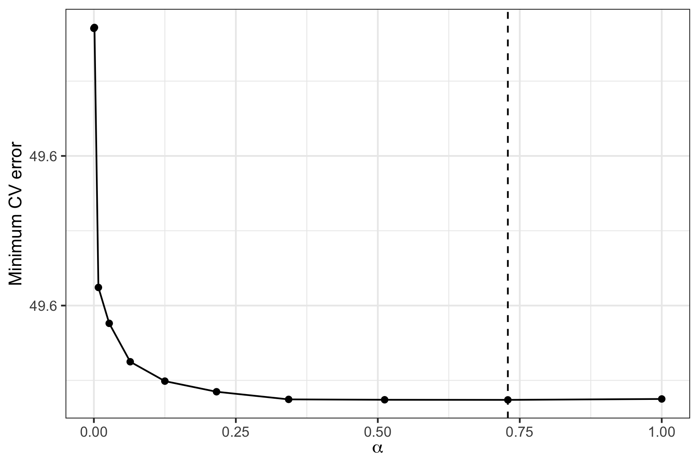
```

**Decision tree CV plot:**

```{r deepest-tree-cv-plot, out.width = "70%", fig.cap = "This is the CV plot based on information in the CP table for the fitted deepest tree. Only trees with number of splits at least two are plotted, and the x-axis is on a log scale.", fig.align='center', fig.pos = "H", echo = FALSE}
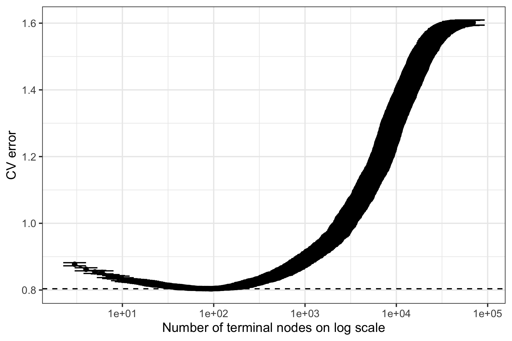
```

**Optimal regression tree:**

```{r optimal-tree-plot, out.width = "100%", fig.cap = "This is the optimal decision tree obtained by pruning back the deepest tree.", fig.align='center', fig.pos = "H", echo = FALSE}
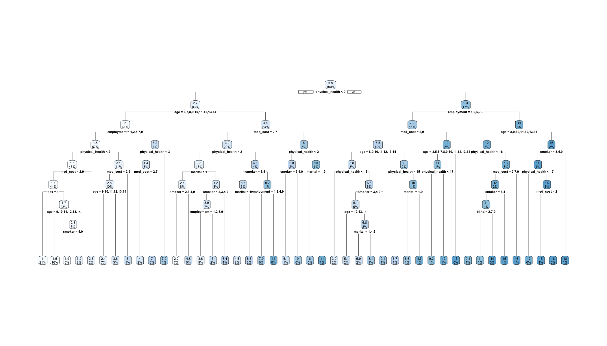
```

**Model training errors:**

```{r train-model-errors, message = FALSE, echo = FALSE}
read_tsv("../results/train-model-evaluation.tsv") %>%
  kable(format = "latex", row.names = NA,
        booktabs = TRUE, digits = 2,
        caption = "These are the root mean squared training 
        errors of the models fitted.") %>%
  kable_styling(position = "center") %>%
  kable_styling(latex_options = "HOLD_position")
```